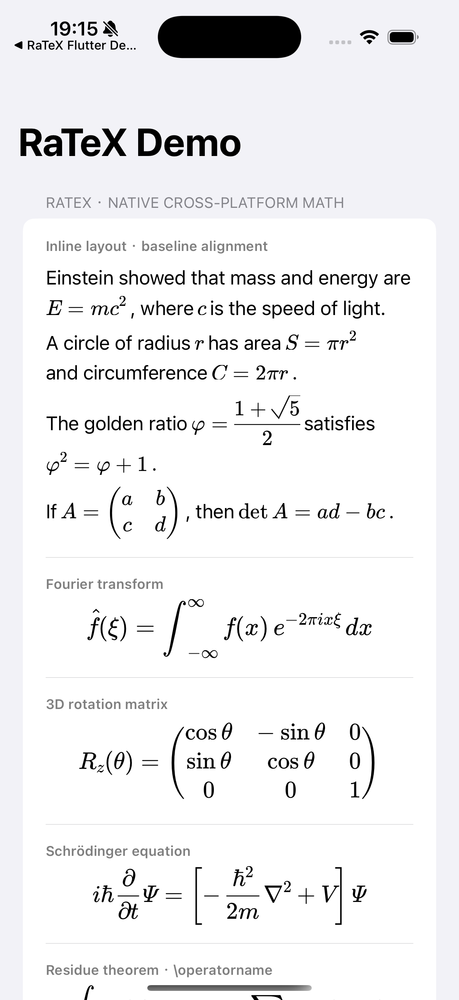
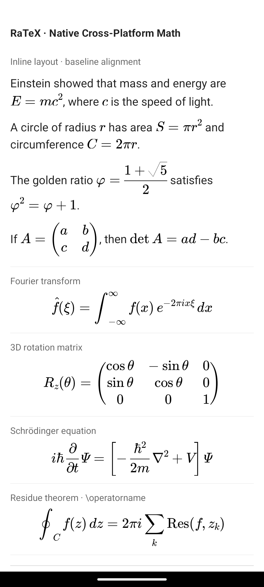
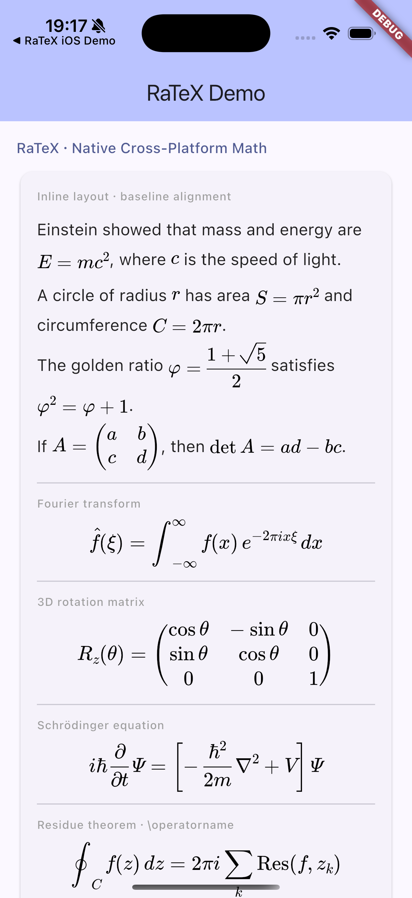
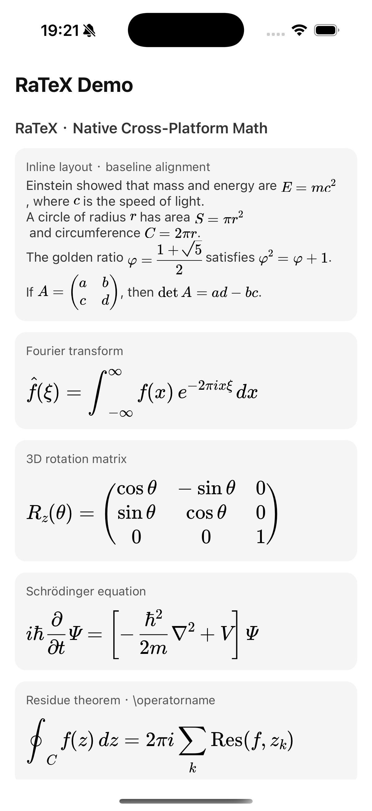
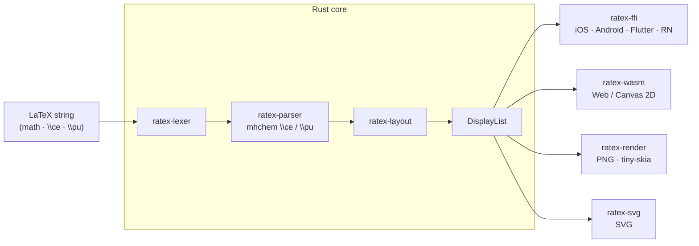

# RaTeX

[简体中文](README.zh-CN.md) | **English**

**KaTeX-compatible math rendering engine in pure Rust — no JavaScript, no WebView, no DOM.**

One Rust core, one display list, every platform renders natively.

```
\frac{-b \pm \sqrt{b^2-4ac}}{2a}   →   iOS · Android · Flutter · React Native · Web · PNG · SVG
```

**[→ Live Demo](https://erweixin.github.io/RaTeX/demo/live.html)** — type LaTeX and compare RaTeX vs KaTeX side-by-side ·
**[→ Support table](https://erweixin.github.io/RaTeX/demo/support-table.html)** — RaTeX vs KaTeX across all test formulas ·
**[→ Web benchmark](https://erweixin.github.io/RaTeX/demo/benchmark.html)** — head-to-head perf in the browser

---

## Why RaTeX?

Every major cross-platform math renderer today runs LaTeX through a browser or JavaScript engine — a hidden WebView eating 50–150 MB RAM, startup latency before the first formula, no offline guarantee. KaTeX is excellent on the web, but on every other surface — iOS, Android, Flutter, server-side, embedded — you're either hosting a WebView or shelling out to headless Chrome.

RaTeX is the same KaTeX-compatible math engine compiled to a portable Rust core, so the *same* renderer runs natively everywhere — and produces byte-identical output across every target.

| | KaTeX | MathJax | **RaTeX** |
|---|---|---|---|
| Runtime | JS (V8) | JS (V8) | **Pure Rust** |
| Surfaces it runs on | Web only* | Web only* | **iOS · Android · Flutter · RN · Web · server · SVG** |
| Mobile | WebView wrapper | WebView wrapper | **Native** |
| Server-side rendering | headless Chrome | mathjax-node | **Single binary, no JS runtime** |
| Output substrate | DOM (`<span>` tree) | DOM / SVG | **Display list → Canvas / PNG / SVG** |
| Memory | GC / heap | GC / heap | **Predictable, no GC** |
| Offline | Depends | Depends | **Yes** |
| Syntax coverage | 100% | ~100% | **~99%** |

<sub>\* Embeddable in non-web targets only by hosting a WebView or headless browser, which most native and server contexts can't tolerate.</sub>

**On the web specifically**, KaTeX has a decade of V8 JIT optimization behind it and remains the obvious choice for web-only projects. RaTeX's contribution isn't beating it on its home turf — it's being the only KaTeX-compatible engine that runs natively on every *other* surface, with pixel-identical output across all of them.

---

## What it renders

**Math** — ~99% of KaTeX syntax: fractions, radicals, integrals, matrices, environments, stretchy delimiters, and more.

**Chemistry** — full mhchem support via `\ce` and `\pu`:

```latex
\ce{H2SO4 + 2NaOH -> Na2SO4 + 2H2O}
\ce{Fe^{2+} + 2e- -> Fe}
\pu{1.5e-3 mol//L}
```

**Physics units** — `\pu` for value + unit expressions following IUPAC conventions.

---

## Platform targets

| Platform | How | Status |
|---|---|---|
| **iOS** | XCFramework + Swift / CoreGraphics | Out of the box |
| **Android** | JNI + Kotlin + Canvas · AAR | Out of the box |
| **Flutter** | Dart FFI + `CustomPainter` | Out of the box |
| **React Native** | Native module + C ABI · iOS/Android views | Out of the box |
| **Web** | WASM → Canvas 2D · `<ratex-formula>` Web Component | Out of the box |
| **Server / CI** | tiny-skia → PNG rasterizer | Out of the box |
| **SVG** | `ratex-svg` → self-contained vector SVG | Out of the box |

### Screenshots

From the demo apps in [`demo/screenshots/`](demo/screenshots/).

**iOS**



**Android**



**Flutter (iOS)**



**React Native (iOS)**



---

## Architecture



| Crate | Role |
|---|---|
| `ratex-types` | Shared types: `DisplayItem`, `DisplayList`, `Color`, `MathStyle` |
| `ratex-font` | KaTeX-compatible font metrics and symbol tables |
| `ratex-lexer` | LaTeX → token stream |
| `ratex-parser` | Token stream → ParseNode AST; includes mhchem `\ce` / `\pu` |
| `ratex-layout` | AST → LayoutBox tree → DisplayList |
| `ratex-ffi` | C ABI: exposes the full pipeline for native platforms |
| `ratex-wasm` | WASM: pipeline → DisplayList JSON for the browser |
| `ratex-render` | Server-side: DisplayList → PNG (tiny-skia) |
| `ratex-svg` | SVG export: DisplayList → SVG string |

---

## Quick start

**Requirements:** Rust 1.70+ ([rustup](https://rustup.rs))

```bash
git clone https://github.com/erweixin/RaTeX.git
cd RaTeX
cargo build --release
```

### Render to PNG

```bash
echo '\frac{1}{2} + \sqrt{x}' | cargo run --release -p ratex-render

echo '\ce{H2SO4 + 2NaOH -> Na2SO4 + 2H2O}' | cargo run --release -p ratex-render
```

### Render to SVG

```bash
# Default: glyphs as <text> elements (correct display requires KaTeX webfonts)
echo '\frac{1}{2} + \sqrt{x}' | cargo run --release -p ratex-svg --features cli

# Standalone: embed glyph outlines as <path> — no external fonts needed
echo '\int_0^\infty e^{-x^2} dx = \frac{\sqrt{\pi}}{2}' | \
  cargo run --release -p ratex-svg --features "cli embed-fonts" -- \
  --output-dir ./out
```

The `standalone` feature (enabled by `cli`) reads KaTeX TTF files and embeds glyph outlines directly into the SVG, producing a fully self-contained file that renders correctly without any CSS or web fonts.

The `embed-fonts` feature (implicitly enables `standalone`) includes the font files in the binary. So no font directory needs to be specified.

### Browser (WASM)

```bash
npm install ratex-wasm
```

```html
<link rel="stylesheet" href="node_modules/ratex-wasm/fonts.css" />
<script type="module" src="node_modules/ratex-wasm/dist/ratex-formula.js"></script>

<ratex-formula latex="\frac{-b \pm \sqrt{b^2-4ac}}{2a}" font-size="48"></ratex-formula>
<ratex-formula latex="\ce{CO2 + H2O <=> H2CO3}" font-size="32"></ratex-formula>
```

See [`platforms/web/README.md`](platforms/web/README.md) for the full setup.

### Platform glue layers

| Platform | Docs |
|---|---|
| iOS | [`platforms/ios/README.md`](platforms/ios/README.md) |
| Android | [`platforms/android/README.md`](platforms/android/README.md) |
| Flutter | [`platforms/flutter/README.md`](platforms/flutter/README.md) |
| React Native | [`platforms/react-native/README.md`](platforms/react-native/README.md) |
| Web | [`platforms/web/README.md`](platforms/web/README.md) |

### Run tests

```bash
cargo test --all
```

---

## Equation numbering and `\tag`

RaTeX aims for KaTeX-compatible rendering. **Automatic equation numbering is not implemented**:

- **No auto-numbering** for `equation`, `align`, `gather`, `alignat`, etc. (their non-starred forms render the same as the starred forms).
- To display a number/label, use **explicit** `\tag{...}` or `\tag*{...}` at the end of a row (amsmath semantics).
- `\notag` / `\nonumber` are treated as no-ops when auto-numbering is not present.

---

## Acknowledgements

RaTeX owes a great debt to [KaTeX](https://katex.org/) — its parser architecture, symbol tables, font metrics, and layout semantics are the foundation of this engine. Chemistry notation (`\ce`, `\pu`) is powered by a Rust port of the [mhchem](https://mhchem.github.io/MathJax-mhchem/) state machine.

---

## Contributing

See [`CONTRIBUTING.md`](CONTRIBUTING.md). To report a security issue, see [`SECURITY.md`](SECURITY.md).

---

## License

MIT — Copyright (c) erweixin.
