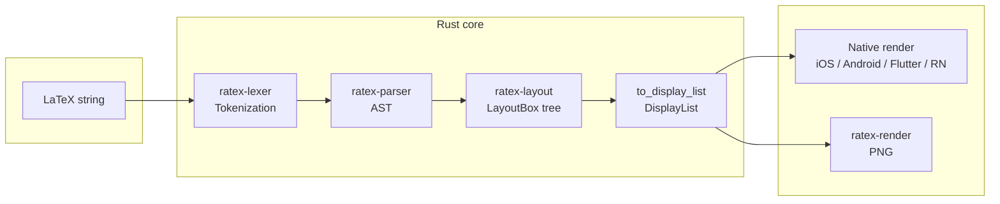
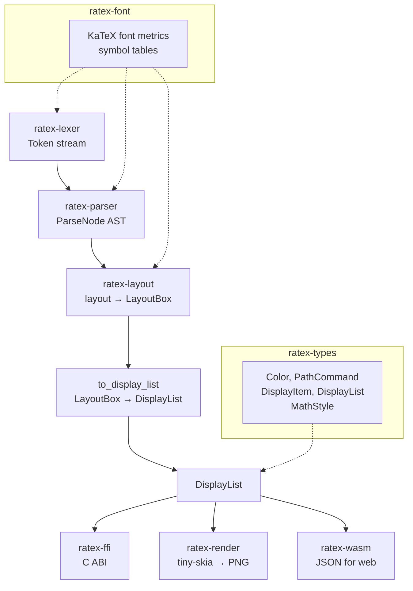

# RaTeX

[简体中文](README.zh-CN.md) | **English**

**KaTeX-compatible math rendering engine in pure Rust — no JavaScript, no WebView, no DOM.**

Parse LaTeX, lay it out with TeX rules, and render it natively on any platform. Glue layers are ready — use out of the box on every platform.

```
\frac{-b \pm \sqrt{b^2 - 4ac}}{2a}   →   iOS · Android · Flutter · React Native · Web · PNG
```

---

## Why RaTeX?

Every major cross-platform math renderer today runs LaTeX through a browser or a JavaScript engine. That means:

- A hidden WebView eating 50–150 MB of RAM
- JavaScript startup latency before the first formula appears
- No offline guarantee, no predictable performance

RaTeX cuts the web stack out entirely. One Rust core, one display list, every platform renders natively.

| | KaTeX (web) | MathJax | **RaTeX** |
|---|---|---|---|
| Runtime | V8 + DOM | V8 + DOM | **Pure Rust** |
| Mobile | WebView | WebView | **Native** |
| Offline | Depends | Depends | **Yes** |
| Bundle overhead | ~280 kB JS | ~500 kB JS | **0 kB JS** |
| Memory model | GC / heap | GC / heap | **Predictable** |
| Syntax coverage | 100% | ~100% | **~99%** |

---

## Key facts

- **~99%** of KaTeX formula syntax — parses and lays out the same LaTeX source
- **~80%** visual similarity to KaTeX (golden test score against KaTeX reference renders)
- **One display list** output: flat, serializable drawing commands consumed by any renderer
- **C ABI** (`ratex-ffi`) for FFI from Swift, Kotlin, Dart, Go, C++
- **Platform glue layers**: iOS / Android / Flutter / React Native bindings ready — **out of the box**
- **WASM** (`ratex-wasm`) for drop-in browser use via `<ratex-formula>` Web Component
- **Server-side PNG** via tiny-skia — no browser needed

**[→ Live Demo](https://erweixin.github.io/RaTeX/demo/index.html)** — type LaTeX and compare RaTeX (Rust/WASM) vs KaTeX side-by-side · 
**[→ Support table](https://erweixin.github.io/RaTeX/demo/support_table.html)** — RaTeX vs KaTeX across all 916 test formulas

---

## Platform targets

| Platform | How | Status |
|---|---|---|
| **Web** | WASM → Canvas 2D · `<ratex-formula>` Web Component | Working |
| **Server / CI** | tiny-skia → PNG rasterizer | Working |
| **iOS** | Swift/ObjC bindings to C ABI · XCFramework | Out of the box |
| **Android** | JNI → Kotlin/Java · AAR | Out of the box |
| **React Native** | Native module via C ABI | Binding layer in progress |
| **Flutter** | Dart FFI via C ABI | Out of the box |

> Rust core and per-platform glue layers are ready; integrate and ship.

---

## Architecture

### Pipeline overview

Rendering a LaTeX formula goes through four stages: **tokenization** → **parsing** → **layout** → **display list**. The display list is a flat list of drawing commands (glyphs, lines, rectangles, paths) with absolute coordinates; it is consumed either by native UI (iOS/Android/Flutter/RN) or by the server-side rasterizer (tiny-skia → PNG).



### Data flow (detailed)



- **ratex-lexer**: Turns the LaTeX source string into a stream of tokens (commands, braces, symbols, etc.).
- **ratex-parser**: Builds a **ParseNode** AST (KaTeX-compatible), with macro expansion and function dispatch.
- **ratex-layout**: Takes the AST and produces a **LayoutBox** tree (horizontal/vertical boxes, glyphs, rules, fractions, etc.) using TeX-style metrics and rules. Then **to_display_list** converts the LayoutBox tree into a flat **DisplayList**.
- **DisplayList**: Serializable list of `DisplayItem`s (GlyphPath, Line, Rect, Path). Consumed by:
  - **ratex-ffi**: Exposes the pipeline via C ABI for iOS/Android/RN/Flutter to render natively.
  - **ratex-render**: Rasterizes the display list to PNG using tiny-skia (server-side).
  - **ratex-wasm**: Exposes the same pipeline to the browser; returns DisplayList as JSON for Canvas 2D (or other) rendering.

### Crate roles

| Crate          | Role |
|----------------|------|
| `ratex-types`  | Shared types: `Color`, `PathCommand`, `DisplayItem`, `DisplayList`, `MathStyle`. |
| `ratex-font`   | Font metrics and symbol tables (KaTeX-compatible fonts). |
| `ratex-lexer`  | LaTeX lexer → token stream. |
| `ratex-parser` | LaTeX parser → ParseNode AST (KaTeX-compatible syntax). |
| `ratex-layout` | Math layout engine: AST → LayoutBox tree → **to_display_list** → DisplayList. |
| `ratex-render` | Server-side only: rasterize DisplayList to PNG (tiny-skia + ab_glyph). |
| `ratex-ffi`    | C ABI: full pipeline → DisplayList for iOS, Android, RN, Flutter to render natively. |
| `ratex-wasm`   | WebAssembly: parse + layout → DisplayList as JSON for browser rendering. |

### Text pipeline (summary)

```
LaTeX formula string
        ↓
ratex-lexer   → tokenization
        ↓
ratex-parser  → ParseNode AST
        ↓
ratex-layout  → LayoutBox tree → to_display_list → DisplayList
        ↓
ratex-ffi     → display list (iOS / Android / RN / Flutter → native render)
        or
ratex-render  → server-side rasterize to PNG (tiny-skia)
        or
ratex-wasm    → DisplayList JSON (web)
```

## Quick start

**Requirements:** Rust 1.70+ ([rustup](https://rustup.rs))

```bash
git clone https://github.com/erweixin/RaTeX.git
cd RaTeX
cargo build --release
```

### Render to PNG

```bash
echo '\frac{1}{2} + \sqrt{x}' | cargo run --release -p ratex-render

# With custom font and output directories
echo '\sum_{i=1}^n i = \frac{n(n+1)}{2}' | cargo run --release -p ratex-render -- \
  --font-dir /path/to/katex/fonts \
  --output-dir ./out
```

### Use in the browser (WASM)

```html
<!-- 1. Fonts -->
<link rel="stylesheet" href="node_modules/ratex-web/fonts.css" />

<!-- 2. Register the Web Component -->
<script type="module" src="node_modules/ratex-web/dist/ratex-formula.js"></script>

<!-- 3. Done -->
<ratex-formula latex="\frac{-b \pm \sqrt{b^2-4ac}}{2a}" font-size="48"></ratex-formula>
```

See [`platforms/web/README.md`](platforms/web/README.md) for the full WASM + web-render setup.

### Platform glue layers (out of the box)

| Platform | Docs |
|----------|------|
| iOS | [`platforms/ios/README.md`](platforms/ios/README.md) — XCFramework + Swift/CoreGraphics |
| Android | [`platforms/android/README.md`](platforms/android/README.md) — AAR + Kotlin/Canvas |
| Flutter | [`platforms/flutter/README.md`](platforms/flutter/README.md) — Dart FFI |
| Web | [`platforms/web/README.md`](platforms/web/README.md) — WASM + Web Component |

### Run tests

```bash
cargo test --all
```

---

## Crate map

| Crate | Role |
|---|---|
| `ratex-types` | Shared types: `DisplayItem`, `DisplayList`, `Color`, `MathStyle` |
| `ratex-font` | KaTeX-compatible font metrics and symbol tables |
| `ratex-lexer` | LaTeX → token stream |
| `ratex-parser` | Token stream → ParseNode AST (KaTeX-compatible) |
| `ratex-layout` | AST → LayoutBox tree → DisplayList |
| `ratex-ffi` | C ABI: exposes the full pipeline for native platforms |
| `ratex-wasm` | WASM: pipeline → DisplayList JSON for the browser |
| `ratex-render` | Server-side: DisplayList → PNG (tiny-skia) |

---

## KaTeX compatibility

- **Formula support (~99%):** The same LaTeX source rendered by KaTeX in the browser and by RaTeX on device. We continue to close remaining gaps.
- **Visual similarity (~80%):** Golden tests compare RaTeX-rendered PNGs to KaTeX reference PNGs using an ink-coverage score (IoU of ink pixels, recall, aspect and width similarity). 80% is the visual likeness score — not the share of formulas supported, which is ~99%.

---

## Acknowledgement: KaTeX

Ratex owes a great debt to [KaTeX](https://katex.org/). KaTeX is the de facto reference for fast, rigorous LaTeX math on the web; its parser, symbol tables, and layout semantics follow Donald Knuth's TeX standard. We use KaTeX’s font metrics and golden outputs to validate Ratex, and we aim for **syntax and visual compatibility** so that the same LaTeX source can be rendered consistently by KaTeX in the browser and by Ratex on native platforms. We thank the KaTeX project and contributors for their open, well-documented work—without it, this engine would not exist.

---

## License

MIT — Copyright (c) erweixin.
