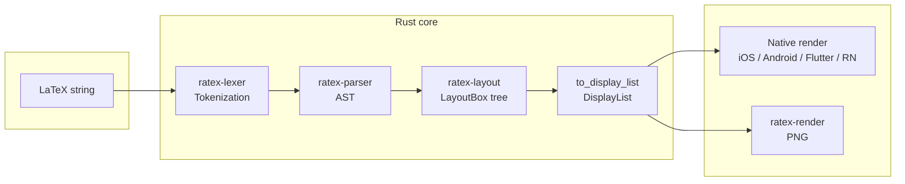
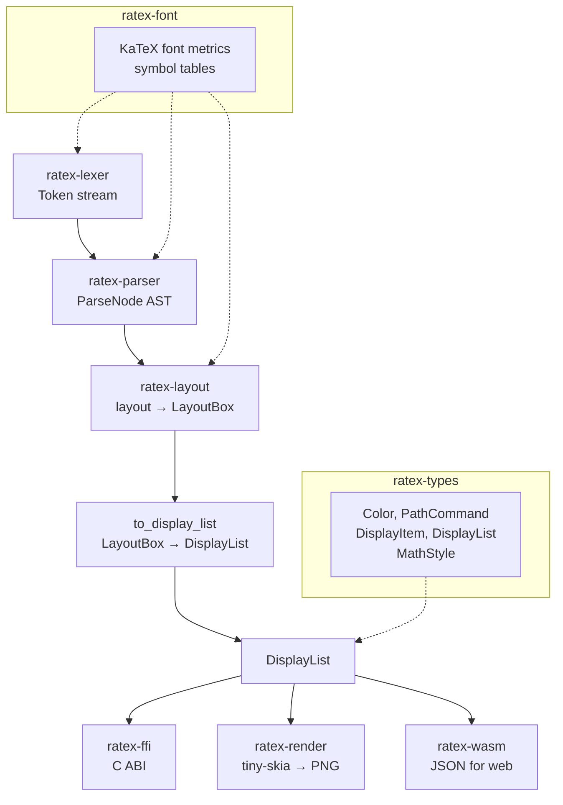

# RaTeX

**简体中文** | [English](README.md)

**项目站点：** [erweixin.github.io/RaTeX](https://erweixin.github.io/RaTeX/)（首页与 Math / Chemistry / Physics 公式画廊）

**纯 Rust 实现的 KaTeX 兼容数学渲染引擎 — 无 JavaScript、无 WebView、无 DOM。**

解析 LaTeX，按 TeX 规则排版，在任意平台原生渲染。**胶水层已就绪，各平台开箱即用。**

```
\frac{-b \pm \sqrt{b^2 - 4ac}}{2a}   →   iOS · Android · Flutter · React Native · Web · PNG
```

---

## 为什么选 RaTeX？

目前主流的跨平台数学渲染方案都依赖浏览器或 JavaScript 引擎跑 LaTeX，带来的问题是：

- 隐藏的 WebView 占用 50–150 MB 内存
- 首屏公式要等 JavaScript 启动
- 无法保证离线、性能不可预期

RaTeX 完全去掉 Web 栈：一个 Rust 核心、一套显示列表，各平台原生渲染。

| | KaTeX (Web) | MathJax | **RaTeX** |
|---|---|---|---|
| 运行时 | V8 + DOM | V8 + DOM | **纯 Rust** |
| 移动端 | WebView | WebView | **原生** |
| 离线 | 视情况 | 视情况 | **支持** |
| 包体积 | ~280 kB JS | ~500 kB JS | **0 kB JS** |
| 内存模型 | GC / 堆 | GC / 堆 | **可预期** |
| 语法覆盖 | 100% | ~100% | **~99%** |

---

## 要点

- **~99%** 的 KaTeX 公式语法 — **目标**是在该范围内的 LaTeX 与 KaTeX 走同一套解析与排版语义；实现仍在推进，**请在自身业务语料上自行验证**。**请不要把下面的 ~80% 理解成「项目/公式只完成了八成」** —— 它只是 PNG 光栅对比的汇总指标。
- **~80%** 黄金测试相对 KaTeX 参考 PNG 的**汇总**得分（**泼墨 / 墨迹覆盖度**度量 — **不是**语法覆盖率，也 **不是**引擎或公式支持的完成度；**大量**用例已与 KaTeX **非常接近**；详见下文 **项目现状**）
- **单一显示列表**：扁平的、可序列化的绘图指令，供任意渲染器消费
- **C ABI**（`ratex-ffi`）供 Swift、Kotlin、Dart、Go、C++ 等 FFI 调用
- **各平台胶水层**：iOS / Android / Flutter / React Native 绑定就绪，**开箱即用**
- **WASM**（`ratex-wasm`）通过 `<ratex-formula>` Web 组件在浏览器中即插即用
- **服务端 PNG** 通过 tiny-skia — 无需浏览器

**[→ 在线演示](https://erweixin.github.io/RaTeX/demo/live.html)** — 输入 LaTeX，对比 RaTeX (Rust/WASM) 与 KaTeX
**[→ 支持表](https://erweixin.github.io/RaTeX/demo/support-table.html)** — 916 条测试公式的 RaTeX vs KaTeX 对比

---

## 项目现状

**公式侧覆盖面较广，但与黄金分不是一回事。** ~**99%** 表示我们**希望**与 KaTeX 公式子集对齐的范围；具体是否满足你的场景，仍建议用真实公式与视觉结果核对。醒目的 **~80%** **不能**概括「公式支持做到哪一步」—— 它只是自动化 **PNG 对 PNG** 黄金测试的汇总结果。

**语法覆盖与像素级 1:1 仍是两件事。** 对纳入范围的源码，目标是与 KaTeX 一致的解析与排版路径；**仍有**语法/排版边界在修补，但**不宜**仅凭 ~80% 光栅分推断剩余工作量。

**黄金测试**将 RaTeX 与 KaTeX 各自光栅化为 PNG，再用 **泼墨（墨迹覆盖度）** 类指标打分（墨迹像素重叠 / 类 IoU 信号，并配合几何项）。**整套用例的汇总**得分约为 **~80%** —— 这 **不是** 每条 `test_cases` 都已与 KaTeX 像素级 1:1，也 **不是**「只有 80% 的公式能用」，更 **不是**「整个项目只完成了约八成」。**许多**单条用例的相似度已经 **很高**；平均值会被更难的对齐问题拉低（度量、路径、hinting、抗锯齿以及其它光栅/排版细节）。

**为何细微间距也会明显拉低泼墨分：** 算法是在 **像素栅格** 上统计「哪些像素算墨迹」，再比较参考图与待测图的墨迹集合重叠（类 IoU）。**两个字母之间**的 **间距或字偶** 只差 **不到一像素**（亚像素级排版舍入），字形轮廓在栅格上的落点就会整体偏移，墨迹掩膜 **对不齐**，重叠度会 **明显下降** —— 肉眼有时仍觉得「几乎一样」。**抗锯齿**会放大这种效应：笔画边缘是半透明像素，轻微错位就会牵动一圈边界像素。因此汇总的 ~80% 是 **偏严的像素级** 指标：里面 **既有** 真实排版差异，也 **包含**「差一点没对齐像素」带来的惩罚，**不能**直接当成「看起来有多像」的百分比。

**LaTeX 数学公式本身很复杂**，边界情况叠加很快。**非常需要大家的反馈**：若实际使用中发现渲染不对，请带上 **完整 LaTeX 源码**（如能附截图更好）提 Issue，便于我们固化成回归用例。见 [`CONTRIBUTING.md`](CONTRIBUTING.md)。

---

## 平台支持

| 平台 | 方式 | 状态 |
|---|---|---|
| **Web** | WASM → Canvas 2D · `<ratex-formula>` Web 组件 | 可用 |
| **服务端 / CI** | tiny-skia → PNG 光栅化 | 可用 |
| **iOS** | Swift/ObjC 绑定 C ABI · XCFramework | 开箱即用 |
| **Android** | JNI → Kotlin/Java · AAR | 开箱即用 |
| **React Native** | C ABI Native 模块 · iOS/Android 原生视图 | 开箱即用 |
| **Flutter** | Dart FFI 调用 C ABI | 开箱即用 |

> Rust 核心与全部平台胶水层（iOS、Android、Flutter、React Native、Web）均已就绪，可直接集成使用。

---

## 架构

### 流水线概览

LaTeX 公式渲染经历四个阶段：**词法** → **解析** → **排版** → **显示列表**。显示列表是一组带绝对坐标的绘图指令（字形、线段、矩形、路径）；由原生 UI（iOS/Android/Flutter/RN）或服务端光栅器（tiny-skia → PNG）消费。



### 数据流（详）



- **ratex-lexer**：将 LaTeX 源码转为 token 流（命令、括号、符号等）。
- **ratex-parser**：构建 **ParseNode** AST（兼容 KaTeX），含宏展开与函数分发。
- **ratex-layout**：根据 AST 生成 **LayoutBox** 树（横/竖盒、字形、分数线、分式等），使用 TeX 风格度量与规则；**to_display_list** 将 LayoutBox 树转为扁平 **DisplayList**。
- **DisplayList**：可序列化的 `DisplayItem` 列表（GlyphPath、Line、Rect、Path）。由以下模块消费：
  - **ratex-ffi**：通过 C ABI 暴露流水线，供 iOS/Android/RN/Flutter 原生渲染。
  - **ratex-render**：用 tiny-skia 将显示列表光栅化为 PNG（服务端）。
  - **ratex-wasm**：在浏览器中暴露同一流水线；返回 DisplayList 的 JSON，供 Canvas 2D（或其他）渲染。

### Crate 职责

| Crate | 职责 |
|--------|------|
| `ratex-types` | 共享类型：`Color`、`PathCommand`、`DisplayItem`、`DisplayList`、`MathStyle`。 |
| `ratex-font` | 字体度量与符号表（兼容 KaTeX 字体）。 |
| `ratex-lexer` | LaTeX 词法 → token 流。 |
| `ratex-parser` | LaTeX 解析 → ParseNode AST（兼容 KaTeX 语法）。 |
| `ratex-layout` | 数学排版：AST → LayoutBox 树 → **to_display_list** → DisplayList。 |
| `ratex-render` | 仅服务端：DisplayList 光栅化为 PNG（tiny-skia + ab_glyph）。 |
| `ratex-ffi` | C ABI：完整流水线 → DisplayList，供 iOS、Android、RN、Flutter 原生渲染。 |
| `ratex-wasm` | WebAssembly：解析 + 排版 → DisplayList 的 JSON，供浏览器渲染。 |

### 文本流水线（小结）

```
LaTeX 公式字符串
        ↓
ratex-lexer   → 词法
        ↓
ratex-parser  → ParseNode AST
        ↓
ratex-layout  → LayoutBox 树 → to_display_list → DisplayList
        ↓
ratex-ffi     → 显示列表（iOS / Android / RN / Flutter → 原生渲染）
        或
ratex-render  → 服务端光栅化为 PNG（tiny-skia）
        或
ratex-wasm    → DisplayList JSON（Web）
```

## 快速开始

**环境要求：** Rust 1.70+（[rustup](https://rustup.rs)）

```bash
git clone https://github.com/erweixin/RaTeX.git
cd RaTeX
cargo build --release
```

### 渲染为 PNG

```bash
echo '\frac{1}{2} + \sqrt{x}' | cargo run --release -p ratex-render

# 指定字体与输出目录
echo '\sum_{i=1}^n i = \frac{n(n+1)}{2}' | cargo run --release -p ratex-render -- \
  --font-dir /path/to/katex/fonts \
  --output-dir ./out
```

### 在浏览器中使用（WASM）

```bash
npm install ratex-wasm
```

```html
<!-- 1. 字体 -->
<link rel="stylesheet" href="node_modules/ratex-wasm/fonts.css" />

<!-- 2. 注册 Web 组件 -->
<script type="module" src="node_modules/ratex-wasm/dist/ratex-formula.js"></script>

<!-- 3. 使用 -->
<ratex-formula latex="\frac{-b \pm \sqrt{b^2-4ac}}{2a}" font-size="48"></ratex-formula>
```

完整 WASM + Web 渲染说明见 [`platforms/web/README.md`](platforms/web/README.md)。

### 各平台胶水层（开箱即用）

| 平台 | 文档 |
|------|------|
| iOS | [`platforms/ios/README.md`](platforms/ios/README.md) — XCFramework + Swift/CoreGraphics |
| Android | [`platforms/android/README.md`](platforms/android/README.md) — AAR + Kotlin/Canvas |
| Flutter | [`platforms/flutter/README.md`](platforms/flutter/README.md) — Dart FFI |
| React Native | [`platforms/react-native/README.md`](platforms/react-native/README.md) — Native 模块 + Fabric / Bridge 视图 |
| Web | [`platforms/web/README.md`](platforms/web/README.md) — WASM + Web 组件 |

### 运行测试

```bash
cargo test --all
```

---

## Crate 一览

| Crate | 职责 |
|-------|------|
| `ratex-types` | 共享类型：DisplayItem、DisplayList、Color、MathStyle |
| `ratex-font` | 兼容 KaTeX 的字体度量与符号表 |
| `ratex-lexer` | LaTeX → token 流 |
| `ratex-parser` | token 流 → ParseNode AST（兼容 KaTeX） |
| `ratex-layout` | AST → LayoutBox 树 → DisplayList |
| `ratex-ffi` | C ABI：向各原生平台暴露完整流水线 |
| `ratex-wasm` | WASM：流水线 → DisplayList JSON（浏览器） |
| `ratex-render` | 服务端：DisplayList → PNG（tiny-skia） |

---

## KaTeX 兼容性

- **公式支持（~99%）：** 同一 LaTeX 源码**设计上**应在浏览器（KaTeX）与设备 / WASM（RaTeX）上均可渲染。与 KaTeX 对齐的公式**覆盖面较广**，但**并非**所有边角都已收敛；**这些都不适合**用 ~80% 黄金分来概括。
- **黄金 / 视觉得分（汇总 ~80%）：** PNG 成对比较采用 **泼墨（墨迹覆盖度）** 指标（墨迹像素重叠、召回、宽高比与宽度相似度等），衡量的是**光栅**层面的整体接近程度 —— **不是**「公式支持完成了百分之几」；**大量**单条用例得分远高于汇总均值。详见上文 **项目现状**。

---

## 致谢：KaTeX

RaTeX 深受 [KaTeX](https://katex.org/) 启发。KaTeX 是 Web 上快速、严谨的 LaTeX 数学渲染的事实标准；其解析器、符号表与排版语义遵循 Donald Knuth 的 TeX 规范。我们使用 KaTeX 的字体度量和黄金输出来验证 RaTeX，并追求**语法与视觉兼容**，使同一 LaTeX 源码在浏览器中用 KaTeX、在原生平台用 RaTeX 都能一致渲染。感谢 KaTeX 项目与贡献者的开放与文档 — 没有它，本引擎无法存在。

---

## 参与贡献

见 [`CONTRIBUTING.md`](CONTRIBUTING.md)。若需**私下**报告安全问题，见 [`SECURITY.md`](SECURITY.md)。

---

## 许可证

MIT — Copyright (c) erweixin.
