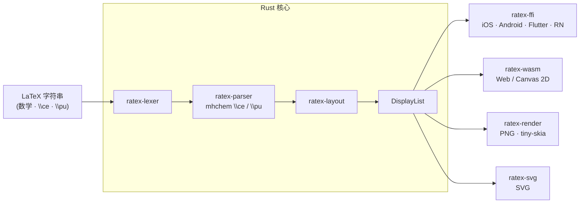

# RaTeX

**简体中文** | [English](README.md)

**纯 Rust 实现的 KaTeX 兼容数学渲染引擎 — 无 JavaScript、无 WebView、无 DOM。**

一个 Rust 核心，一套显示列表，各平台原生渲染。

```
\frac{-b \pm \sqrt{b^2-4ac}}{2a}   →   iOS · Android · Flutter · React Native · Web · PNG · SVG
```

**[→ 在线演示](https://erweixin.github.io/RaTeX/demo/live.html)** — 输入 LaTeX，对比 RaTeX vs KaTeX ·
**[→ 支持表](https://erweixin.github.io/RaTeX/demo/support-table.html)** — 全量测试公式的 RaTeX vs KaTeX 对比 ·
**[→ Web 性能基准](https://erweixin.github.io/RaTeX/demo/benchmark.html)** — 浏览器内的正面性能对比

---

## 为什么选 RaTeX？

目前主流的跨平台数学渲染方案都依赖浏览器或 JavaScript 引擎跑 LaTeX，带来隐藏 WebView 占用 50–150 MB 内存、首屏公式要等 JS 启动、无法保证离线等问题。KaTeX 在 Web 上非常出色，但在其他任何目标——iOS、Android、Flutter、服务端、嵌入式——你要么内嵌 WebView，要么调用 headless Chrome。

RaTeX 是同一个 KaTeX 兼容的数学引擎，但编译到一个可移植的 Rust 核心：**同一套渲染器在每个平台原生运行**，并在所有目标上产出**像素一致**的输出。

| | KaTeX | MathJax | **RaTeX** |
|---|---|---|---|
| 运行时 | JS (V8) | JS (V8) | **纯 Rust** |
| 可运行的目标 | 仅 Web* | 仅 Web* | **iOS · Android · Flutter · RN · Web · 服务端 · SVG** |
| 移动端 | WebView 套壳 | WebView 套壳 | **原生** |
| 服务端渲染 | headless Chrome | mathjax-node | **单二进制，无需 JS 运行时** |
| 输出形态 | DOM（`<span>` 树）| DOM / SVG | **显示列表 → Canvas / PNG / SVG** |
| 内存模型 | GC / 堆 | GC / 堆 | **可预期，无 GC** |
| 离线 | 视情况 | 视情况 | **支持** |
| 语法覆盖 | 100% | ~100% | **~99%** |

<sub>\* 在非 Web 目标上只能通过内嵌 WebView 或 headless 浏览器使用，而大多数原生和服务端场景都无法接受这种方式。</sub>

**单看 Web**，KaTeX 背后有十年的 V8 JIT 优化积累，对纯 Web 项目仍然是显而易见的选择。RaTeX 的价值不在于在 KaTeX 的主场击败它，而在于：它是**唯一**一个能在所有其他平台原生运行的 KaTeX 兼容引擎，且在所有平台之间输出像素一致。

---

## 能渲染什么

**数学公式** — ~99% 的 KaTeX 语法：分数、根号、积分、矩阵、各类环境、伸缩定界符等。

**化学方程式** — 通过 `\ce` 和 `\pu` 完整支持 mhchem：

```latex
\ce{H2SO4 + 2NaOH -> Na2SO4 + 2H2O}
\ce{Fe^{2+} + 2e- -> Fe}
\pu{1.5e-3 mol//L}
```

**物理单位** — `\pu` 支持符合 IUPAC 规范的数值+单位表达式。

---

## 平台支持

| 平台 | 方式 | 状态 |
|---|---|---|
| **iOS** | XCFramework + Swift / CoreGraphics | 开箱即用 |
| **Android** | JNI + Kotlin + Canvas · AAR | 开箱即用 |
| **Flutter** | Dart FFI + `CustomPainter` | 开箱即用 |
| **React Native** | C ABI Native 模块 · iOS/Android 原生视图 | 开箱即用 |
| **Web** | WASM → Canvas 2D · `<ratex-formula>` Web 组件 | 开箱即用 |
| **服务端 / CI** | tiny-skia → PNG 光栅化 | 开箱即用 |
| **SVG** | `ratex-svg` → 自包含矢量 SVG 导出 | 开箱即用 |

### 截图

演示应用截图见 [`demo/screenshots/`](demo/screenshots/)。

**iOS**


**Android**


**Flutter（iOS）**


**React Native（iOS）**


---

## 架构



| Crate | 职责 |
|---|---|
| `ratex-types` | 共享类型：`DisplayItem`、`DisplayList`、`Color`、`MathStyle` |
| `ratex-font` | 兼容 KaTeX 的字体度量与符号表 |
| `ratex-lexer` | LaTeX → token 流 |
| `ratex-parser` | token 流 → ParseNode AST；含 mhchem `\ce` / `\pu` |
| `ratex-layout` | AST → LayoutBox 树 → DisplayList |
| `ratex-ffi` | C ABI：向各原生平台暴露完整流水线 |
| `ratex-wasm` | WASM：流水线 → DisplayList JSON（浏览器） |
| `ratex-render` | 服务端：DisplayList → PNG（tiny-skia） |
| `ratex-svg` | SVG 导出：DisplayList → SVG 字符串 |

---

## 快速开始

**环境要求：** Rust 1.70+（[rustup](https://rustup.rs)）

```bash
git clone https://github.com/erweixin/RaTeX.git
cd RaTeX
cargo build --release
```

### 渲染为 PNG

```bash
echo '\frac{1}{2} + \sqrt{x}' | cargo run --release -p ratex-render

echo '\ce{H2SO4 + 2NaOH -> Na2SO4 + 2H2O}' | cargo run --release -p ratex-render
```

### 渲染为 SVG

```bash
# 默认模式：字形输出为 <text> 元素（正确显示需要 KaTeX 网络字体）
echo '\frac{1}{2} + \sqrt{x}' | cargo run --release -p ratex-svg --features cli

# 自包含模式：将字形轮廓嵌入为 <path>，无需外部字体
echo '\int_0^\infty e^{-x^2} dx = \frac{\sqrt{\pi}}{2}' | \
  cargo run --release -p ratex-svg --features cli -- \
  --font-dir /path/to/katex/fonts --output-dir ./out
```

`standalone` feature（即 `cli` 所依赖的特性）会从 KaTeX TTF 文件中提取字形轮廓并内嵌到 SVG，生成无需任何 CSS 或网络字体即可正确渲染的完全自包含文件。

### 在浏览器中使用（WASM）

```bash
npm install ratex-wasm
```

```html
<link rel="stylesheet" href="node_modules/ratex-wasm/fonts.css" />
<script type="module" src="node_modules/ratex-wasm/dist/ratex-formula.js"></script>

<ratex-formula latex="\frac{-b \pm \sqrt{b^2-4ac}}{2a}" font-size="48"></ratex-formula>
<ratex-formula latex="\ce{CO2 + H2O <=> H2CO3}" font-size="32"></ratex-formula>
```

完整说明见 [`platforms/web/README.md`](platforms/web/README.md)。

### 各平台胶水层

| 平台 | 文档 |
|---|---|
| iOS | [`platforms/ios/README.md`](platforms/ios/README.md) |
| Android | [`platforms/android/README.md`](platforms/android/README.md) |
| Flutter | [`platforms/flutter/README.md`](platforms/flutter/README.md) |
| React Native | [`platforms/react-native/README.md`](platforms/react-native/README.md) |
| Web | [`platforms/web/README.md`](platforms/web/README.md) |

### 运行测试

```bash
cargo test --all
```

---

## 公式编号与 `\tag`

RaTeX 以 KaTeX 兼容为目标，当前 **不实现自动公式编号**：

- `equation` / `align` / `gather` / `alignat` 等**不带星号**的环境，渲染效果与对应的带星号版本一致（即不会自动生成编号）。
- 如需显示编号/标签，请在每行末尾使用显式 `\tag{...}` 或 `\tag*{...}`（遵循 amsmath 语义）。
- 在未实现自动编号时，`\notag` / `\nonumber` 视为无效果（no-op）。

---

## 致谢

RaTeX 深受 [KaTeX](https://katex.org/) 启发——其解析器架构、符号表、字体度量与排版语义是本引擎的基础。化学符号（`\ce`、`\pu`）由 [mhchem](https://mhchem.github.io/MathJax-mhchem/) 状态机的 Rust 移植实现。

---

## 参与贡献

见 [`CONTRIBUTING.md`](CONTRIBUTING.md)。安全问题报告见 [`SECURITY.md`](SECURITY.md)。

---

## 许可证

MIT — Copyright (c) erweixin.
